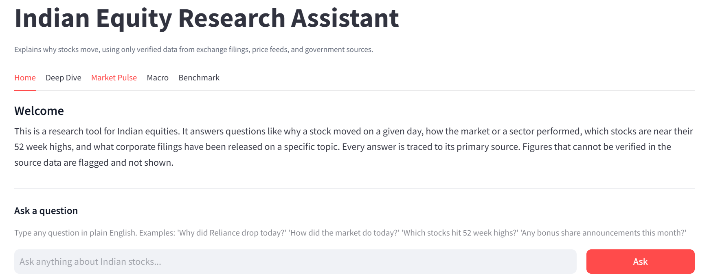
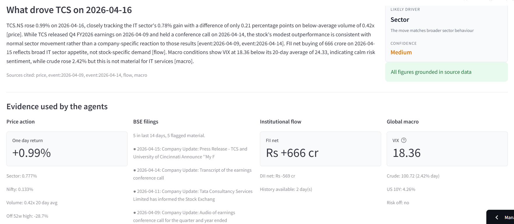
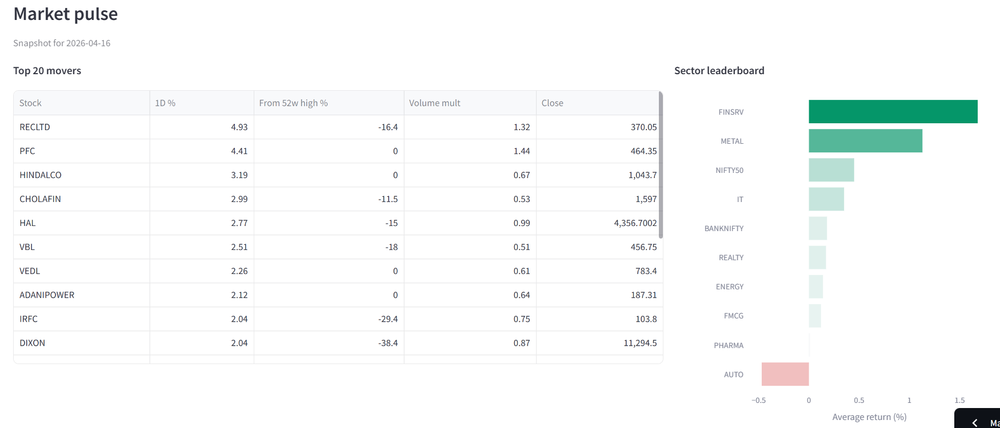
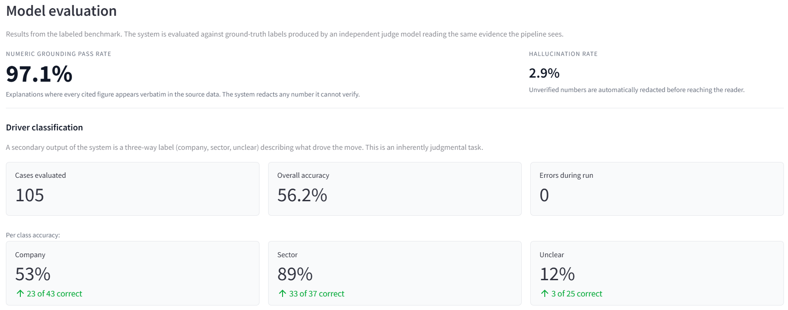

# Indian Equity Research Assistant

Explains why any NSE stock moved on any trading day, using only verified primary sources. Prices from Yahoo Finance. Corporate filings from BSE. Institutional flow from NSE. Global macro from FRED. Every claim in the output is traced back to its source. A validation layer prevents fabricated numbers from reaching the reader.

## Screenshots

Home page, welcome and natural-language query box.



Deep Dive: full pipeline on a single stock, with cited sources and grounding check.



Market pulse: biggest movers and sector performance at a glance.



Model evaluation: measured accuracy on a labeled benchmark.



**Live demo:** [indian-equity-research-assistant.streamlit.app](https://indian-equity-research-assistant.streamlit.app/)

## Example

Query: `Why did Eichermot drop on April 13?`

> EICHERMOT.NS fell 5.04 percent versus the auto index decline of 2.09 percent, an underperformance of 2.95 percentage points on 1.61 times average volume. The March 2026 VECV filing shows mixed results: domestic volumes grew 13.6 percent led by SCV/LMD trucks at 28.6 percent, but exports collapsed 38.8 percent, HD bus fell 69.4 percent, and Volvo trucks declined 18.2 percent. FII net selling of 1,983 crore was offset by DII buying of 2,432 crore. Macro was benign with VIX at 19.12 below its 20 day average of 24.59.
>
> Driver: company specific. Confidence: medium.

Every figure was confirmed present in the cited BSE filing before the answer was shown.

## Architecture

```text
User question
     |
 Orchestrator      classifies the query, extracts symbol and date
     |
     +-> Price agent     OHLCV and feature computations from DuckDB
     +-> Event agent     RAG over BSE filings with PDF enrichment
     +-> Flow agent      daily FII and DII net positions
     +-> Macro agent     FRED series plus risk off detection
     |
 Synthesis         writes the explanation with citations
     |
 Numeric validator extracts every figure, checks against evidence
     |
 Verifier          rewrites or redacts any unverified claim
     |
 Final answer
```

The four data agents run in parallel via LangGraph. Their outputs merge into shared state before synthesis. The validator is deterministic: it parses every number out of the synthesis text and requires an exact token match in the evidence. If a figure cannot be matched, the verifier rewrites the sentence; if the rewrite still contains the unverified figure, a redactor replaces it with `[unverified]` and drops confidence to low.

## Data coverage

- **Stocks**: Nifty 100 (Nifty 50 plus Nifty Next 50)
- **Prices**: two years of daily OHLCV per stock
- **Corporate filings**: 12 months of BSE announcements indexed in ChromaDB with 384 dimensional embeddings, full PDF text fetched on demand
- **Institutional flow**: daily net FII and DII positions from NSE
- **Global macro**: WTI crude, US VIX, US 10 year yield, USD to INR, broad dollar index

## Hallucination resistance

Three independent defences, each catching failures the others miss.

1. **Synthesis prompt with few shot grounding.** Worked examples show how to cite sources, when to report both positive and negative figures in mixed filings, and when to say the evidence is insufficient.
2. **Programmatic numeric validator.** Every number in the output is extracted and matched against the source data using exact token matching, not substring matching. Integer rounding is allowed for values above 100 but disallowed for small decimals.
3. **LLM verifier plus deterministic redactor.** If validation fails, a secondary model rewrites using only cited figures. If the rewrite still fails, regex based redaction physically replaces the offending token with `[unverified]`.

## Benchmark

Evaluated on 105 labeled cases covering 8 trading days of Nifty 100 stocks. Labels produced by Claude Opus 4.6 as an independent judge.

| Metric | Value |
|---|---|
| Numeric grounding pass rate | 97.1% |
| Hallucination rate | 2.9% |
| Primary driver accuracy | 56.2% |
| Errors during run | 0 |

Per class driver accuracy:

| Expected class | Cases | Correct | Accuracy |
|---|---|---|---|
| Company specific | 43 | 23 | 53% |
| Sector led | 37 | 33 | 89% |
| Unclear | 25 | 3 | 12% |

Labels are generated using the LLM as judge pattern (Zheng et al. NeurIPS 2023, OpenAI Evals, Ragas). The judge model is strictly stronger than the synthesis model, which mitigates self preference bias.

## Setup

```bat
python -m venv .venv
.venv\Scripts\activate
pip install -r requirements.txt
copy .env.example .env
```

Edit `.env` and add your API keys. Then bootstrap the data:

```bat
python -m scripts.bootstrap       :: prices and features
python -m scripts.build_rag       :: BSE announcements to ChromaDB
python -m scripts.refresh_macro   :: FRED plus today's FII/DII
python -m scripts.peek            :: confirm row counts
```

## Usage

**Natural language CLI**

```bat
python -m scripts.ask "Why did Eichermot drop on April 13?"
python -m scripts.ask "How did the market do today?"
python -m scripts.ask "Which stocks hit 52 week highs?"
python -m scripts.ask "Any bonus share announcements this month?"
```

**Streamlit dashboard**

```bat
streamlit run src/dashboard/app.py
```

Five tabs: Home (with a natural language query box), Deep Dive, Market Pulse, Macro, and Benchmark.

**REST API**

```bat
uvicorn src.api.main:app --reload --port 8000
```

Interactive Swagger at `http://localhost:8000/docs`.

## Daily automation

A GitHub Actions workflow at `.github/workflows/daily-refresh.yml` runs every weekday evening, refreshes prices, BSE filings, and macro, then commits the updated data to the repo. Deployed Streamlit apps pick up the new data on the next redeploy.

## Project layout

```text
config.py                       watchlist, sector map, model routing
src/
  data/                         DuckDB schema and ingestion clients
  rag/                          ChromaDB collection and query helpers
  agents/
    state.py                    shared TypedDict passed between agents
    prompts.py                  LLM prompts
    llm_client.py               provider routing plus usage logging
    orchestrator.py             query parser
    price_agent.py              price context
    event_agent.py              RAG plus materiality tagging
    flow_agent.py               FII/DII context
    macro_agent.py              FRED context
    synthesis_agent.py          primary LLM call
    validator.py                numeric validator
    verifier_agent.py           rewriter plus redactor
    graph.py                    LangGraph wiring
    handlers.py                 market overview, screen, filings search
  api/main.py                   FastAPI endpoints
  dashboard/app.py              Streamlit app
scripts/
  bootstrap.py                  prices plus features
  build_rag.py                  BSE into ChromaDB
  refresh_macro.py              FRED plus FII/DII
  ask.py                        natural language CLI
  benchmark.py                  runs the labeled evaluation
  diagnose.py                   end to end subsystem health check
benchmark/
  labels.csv                    ground truth labels
  report.json                   machine readable benchmark results
  report.md                     human readable benchmark report
.github/workflows/
  daily-refresh.yml             scheduled data refresh
```

## Known limitations

- **FII and DII history** accumulates daily. NSE's historical endpoint has been unstable across API rotations, so backfill is not available. The five day flow trend activates once at least five trading days have been captured.
- **Some mid cap BSE PDFs** are served behind session cookies that occasionally expire. The PDF cache marks these with status `http_error`; the event agent still works from the headline.
- **Coverage is Nifty 100.** Extending to Nifty 200 is a one time scripcode lookup for the additional 100 companies.
